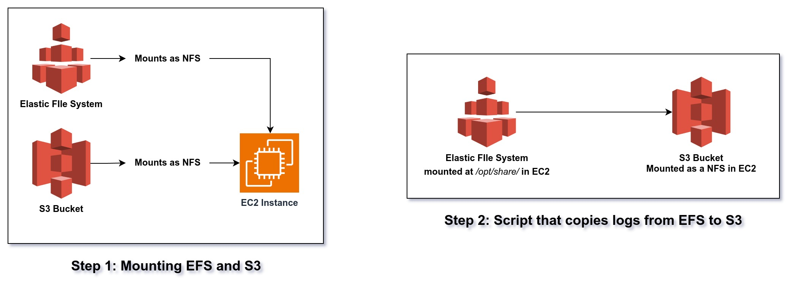

# Architecture 

## Overview

This repository contains Ansible playbooks and scripts developed to automate various tasks in both development (dev) and production (prod) environments across 400+ AWS accounts. These tasks include setting up credentials, mounting Elastic File System (EFS) volumes, mounting S3 buckets as Network File Systems (NFS), and configuring CRON jobs.

## Features

- **Credential Management**: Playbooks are designed to automate the setup of credentials across multiple AWS accounts, ensuring consistency and security.
- **EFS Volume Mounting**: Automated scripts facilitate the seamless mounting of EFS volumes across different environments, reducing manual effort and potential errors.
- **S3 Bucket Integration**: Ansible playbooks enable the mounting of S3 buckets as Network File Systems (NFS), enhancing data accessibility and flexibility.
- **Log Management**: Jobs are configured to automate the movement of logs from EFS to S3, facilitating centralized log management and analysis.

