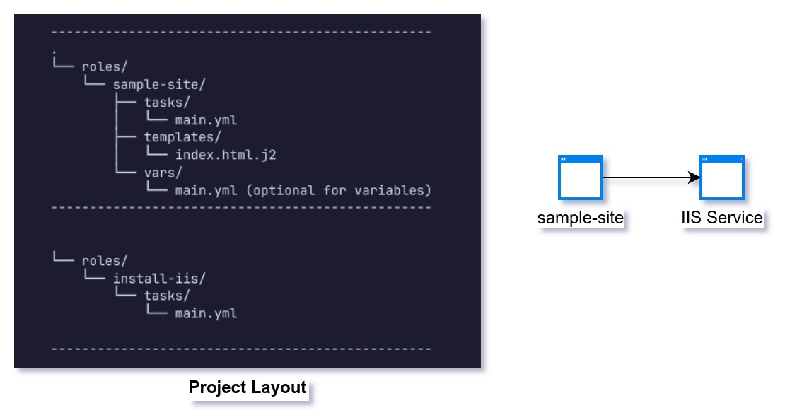

# Ansible IIS Setup for Windows Server

This repository contains an Ansible playbook for setting up IIS (Internet Information Services) on a Windows server hosted on AWS. It includes tasks to create an IIS website, configure it, and deploy a default HTML page using a Jinja2 template.

# Architecture 



## Prerequisites

1. **Ansible**: Ensure you have Ansible installed on your local machine.


2. **AWS Security Group**: Ensure your AWS security group allows inbound traffic on port 5985 (WinRM) and the port you will use for your IIS website (default is 80).

## Folder Structure

The directory structure for the Ansible role is as follows:

```
-------------------------------------------------
.
└── roles/
    └── sample-site/
        ├── tasks/
        │   └── main.yml
        ├── templates/
        │   └── index.html.j2
        └── vars/
            └── main.yml (optional for variables)
-------------------------------------------------


└── roles/
    └── install-iis/
        └── tasks/
            └── main.yml

-------------------------------------------------


```

## Role Overview

### `main.yml`

This file contains the tasks for the role:

```yaml
---
- name: Ensure the physical path for the website exists
  win_file:
    path: C:\inetpub\wwwroot\my_new_site
    state: directory

- name: Copy the HTML template to the web root
  template:
    src: index.html.j2
    dest: C:\inetpub\wwwroot\my_new_site\index.html

- name: Create my_new_site
  community.windows.win_iis_website:
    name: my_new_site
    state: started
    port: '{{ app_port }}'
    physical_path: C:\inetpub\wwwroot\my_new_site
    application_pool: DefaultAppPool
```

### `index.html.j2`

This Jinja2 template file defines the structure of the HTML page that will be deployed:

```html
<!DOCTYPE html>
<html>
<head>
    <title>{{ site_title }}</title>
</head>
<body>
    <h1>{{ header }}</h1>
    <p>{{ message }}</p>
</body>
</html>
```

## Running the Playbook

1. **Create an Inventory File**: Create a file named `hosts.ini` to define your Windows server:

   ```ini
   [windows]
   aws_windows ansible_host=18.130.118.135 ansible_user=YourUsername ansible_password=YourPassword ansible_connection=winrm ansible_winrm_server_cert_validation=ignore
   ```

2. **Define Variables**: Optionally, create a `vars/main.yml` file in the role to define your variables:

   ```yaml
   site_title: "Welcome to My New Site"
   header: "Hello, World!"
   message: "This is my new IIS site!"
   app_port: 80  # Change this if you're using a different port
   ```

3. **Execute the Playbook**: Run the playbook using the following command:

   ```bash
   ansible-playbook -i hosts.ini roles/sample-site/tasks/main.yml
   ```

4. **Access the Website**: Open your web browser and navigate to `http://<your_server_ip>/` or `http://<your_server_ip>:<app_port>/` (replace `<your_server_ip>` with the public IP of your AWS server).

## Troubleshooting

- If you encounter a **403 Forbidden** error, ensure that:
  - You have set up a default document in IIS.
  - You can enable directory browsing if necessary.
  
- Ensure that the physical path for the website exists and has the appropriate permissions for IIS.
