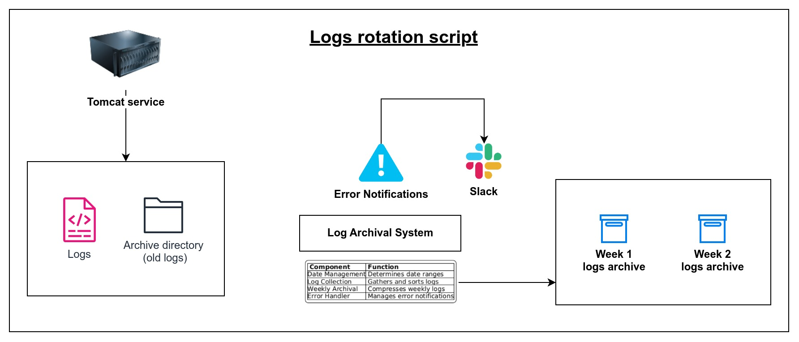

# Tomcat Log Archival Script

A Python script that automates the collection, organization, and archival of Tomcat server logs based on date ranges and specified intervals.

# Architecture 



## Features

- Automatically collects and organizes Tomcat server logs on a weekly basis
- Creates date-based directory structures for organized log storage
- Handles both regular log files and compressed archives
- Moves older logs to an "extra_logs" directory for better management
- Compresses weekly log collections into tar.gz archives
- Sends Slack notifications on errors
- Supports configurable weekly archival schedule

## Directory Structure

The script works with the following directory structure:

```
├── processed_logs/               # Root directory for processed log archives
│   └── DD_MM_YYYY_to_DD_MM_YYYY/    # Date range directories containing:
│       ├── DD_MM_YYYY/              # Daily log directories
│       └── extra_logs/              # Directory for logs outside the date range
├── production_logs/             # Source directory for current logs
│   └── archive/                # Source directory for compressed logs
```

## Configuration

The script uses several configurable parameters:

```python
logs_archival_root_path = "processed_logs/"
tomcat_log_path = "production_logs/"
tomcat_log_path_archive = "production_logs/archive"
starting_day_of_log_archival = "Wednesday"  # Day when weekly archival starts
slack_hook_url = "your_slack_webhook_url"
hostname = "TOMCAT-GW"
```

## How It Works

1. **Date Management**:
   - Determines the current week's date range based on the configured starting day
   - Creates appropriate directory structures for the current and previous weeks

2. **Log Collection**:
   - Searches for logs matching the pattern `ecs-tomcat-*.server.log`
   - Collects logs from both the main log directory and archive directory
   - Organizes logs by creation date into appropriate directories

3. **Weekly Archival**:
   - On the configured archival day (default: Wednesday):
     - Moves older logs to the "extra_logs" directory
     - Compresses the previous week's directory into a tar.gz archive
     - Stores the archive in the root processed logs directory

4. **Error Handling**:
   - Monitors operations for errors
   - Sends notifications to Slack when errors occur
   - Includes detailed error messages and timestamps

## Usage

Run the script using Python 3:

```bash
python3 log_archival.py
```

The script is designed to run daily, but performs different operations based on the current day:
- On regular days: Collects and organizes logs for the previous day
- On the archival day: Performs additional cleanup and compression operations

## Error Notifications

The script sends Slack notifications when errors occur, including:
- File creation date retrieval failures
- Log movement errors
- Directory creation failures
- Compression errors

## Requirements

- Python 3.x
- Required Python packages:
  - `requests`
  - `datetime`
- Unix/Linux environment (uses Unix commands like `ls` and `stat`)
- Write permissions in the configured directories
- Valid Slack webhook URL for notifications

## Note

- The script assumes specific log file naming conventions (ecs-tomcat-*.server.log)
- Requires appropriate file system permissions
- Designed for Unix/Linux environments
- Maintains a rolling 7-day log organization structure